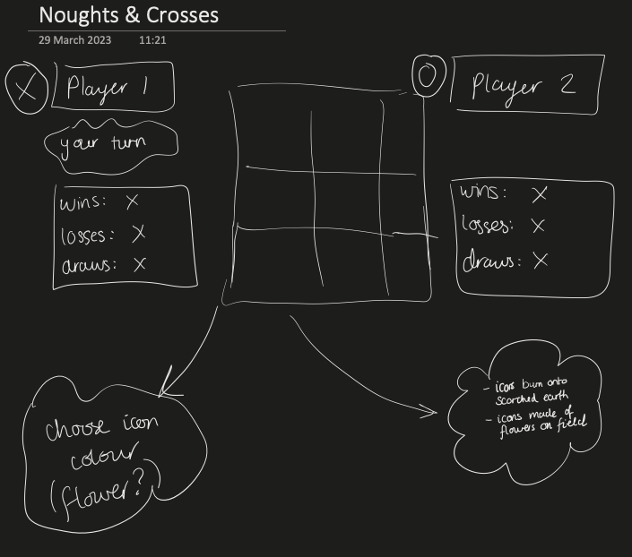

# noughts-and-crosses

This repo contains the source code for my first project of General Assembly's Software Engineering Immersive course (March 13th - June 9th 2023). 

We are at the end of Unit 1: Frontend Fundamentals, so the project focuses on HTML, CSS and JavaScript.

Project 1 runs from 29th March - 3rd April (4 working days) and is an independent project.

___

## Deployment

[Play now via Github Pages](https://louisejooones.github.io/noughts-and-crosses/)


___
## Technologies Used

- HTML
    - Semantic tags
- CSS
    - Flexbox
    - Grid
- JavaScript
    - Classes 
    - DOM manipulation
- VS Code
    - Text editing
    - Accessing Git via CLI
- Chrome developer tools
    - Inspecting elements, layout etc
    - Debugging
- Calligraphr
    - Font design


___
## Brief

### Big Goals

- Build a web application from scratch, without a starter codebase
- Use your programming skills to work out the game logic for a simple game like Tic Tac Toe
- Separate HTML, CSS, and JavaScript files in your application
- Build an application to a specification that someone else gives you
- Build a dynamic game that allows two players to compete from the same computer
- Craft a README.md file that explains your app to the world

### Technical Requirements

Your Noughts and Crosses app must:
- **Render a game board in the browser**
- **Switch turns** between X and O (or whichever markers you select)
- **Visually display which side won** if a player gets three in a row, or show a draw if neither player wins
- **Include separate HTML / CSS / JavaScript files**
- Stick with **KISS (Keep It Simple Stupid)** and **DRY (Don't Repeat Yourself)** principles
- Use **JavaScript** for **DOM manipulation**
- **Deploy your game online**, where the rest of the world can access it
- Use **semantic markup** for HTML and CSS (adhere to best practices)
- Have well-formatted, and well-commented code

### Full Brief

Found at https://git.generalassemb.ly/SEI-LND-71/Project-1


___
## Planning

### User Stories

- As a user, I should be able to start a new noughts and crosses game
- As a user, I should be able to click on a square to add X first and then O, and so on
- As a user, I should be shown a message after each turn for if I win, lose, tie or who's turn it is next
- As a user, I should not be able to click the same square twice
- As a user, I should be shown a message when I win, lose or tie
- As a user, I should not be able to continue playing once I win, lose, or tie
- As a user, I should be able to play the game again without refreshing the page
- As a user, I should be able to give my name so I can track my score
- As a user, I should be able to choose to play in one-player or two-player mode

### Wireframe

I opted for a low fidelity wireframe to show the game layout:



### Project Management
I used this [Trello board](https://trello.com/b/myM3qWxN) to list out different features, order them in terms of priority then set up each day's work to make sure I was moving through the content at enough pace.


___
## Build/Code Process

### 
1. First things first, I wanted to get the holy grail layout in place, to practice using Flexbox whilst the content was extremely simple, as I felt less confident with it.
2. I built the basic board layout using a Grid structure to have something visual to work from.
3. I made classes for players and the game itself (Scoreboard) to keep track of multiple pieces of information without making lots of individual variables, and to practice using modular imports.
4. *Mild distraction* I wanted to have unique icons for my game so took an evening to design and create my own floral font. 
5. I centred my work around the game.js file, importing other helper functions and classes. I followed the DRY principles where possible,
    - Basic game play first (clicking on squares, )
        - I automatically assigned player 1 and player 2 so that I could continue with the MVP game logic without spending too much time on perfecting the players
        - I initially wrote code to make player 1 win every time so I could continue without needing to tackle the game outcome logic
        - I employed class="empty" to enable clicking only on empty squares. This benefited me later as I could easily implement hover effects on only empty squares too.
    - I gave myself lots of time to work through the game outcome logic as it was causing others to struggle (more detail in the Challenges section below!)
6. Once the MVP requirements were complete, I used my remaining time to implement additional bonus features
        - I wanted to incorporate audio with user controls and, given lessons on accessibility, to not include autoplaying background audio. I therefore used different volume icons to illustrate visually the current state of the audio.
7. Validation: I ran my code through various validators to check for issues I hadn't noticed in my own testing
    - HTML: Discovered that some tags self-close, that h1 should not appear more than once on a page, and that modular JavaScript auto-defers.
    - CSS: Corrected a lack of units for the grid-template layout.
    - Accessibility: I used buttons for the game squares and hadn't labelled these so that people using screen readers could tell the difference between the buttons. I now have aria-labels on each game square.

___
## Challenges

### A simple solution to a time-consuming problem!

I was initially lost in over-complicating the problem of showing whose turn it is right now. Effectively I was writing the logic that sits behind toggling a class:

```js
function showTurn() {
    players.forEach(function(player) {
        // if the player's name matches the current player's name
        if (player.name === scoreboard.currentPlayer.name) {
            document.querySelector(`#${scoreboard.currentPlayer.playerNumber}-stats > h3`).classList.add('hidden');
            document.querySelector(`#${scoreboard.otherPlayer.playerNumber}-stats > h3`).classList.remove('hidden');
        }
        else {
            document.querySelector(`#${scoreboard.currentPlayer.playerNumber}-stats > h3`).classList.remove('hidden');
            document.querySelector(`#${scoreboard.otherPlayer.playerNumber}-stats > h3`).classList.add('hidden');
        }
    })
}
```

Applying the principle of KISS, and taking some time away from the problem, allowed me to realise that I could simply toggle the class for each of the players, without needing to sort through who was the current player:

```js
function showTurn() {
    players.forEach(function(player) {
        document.querySelector(`#${player.playerNumber}-turn`).classList.toggle('hidden');
    })
}
```

### Comparison is the thief of joy

Trying to choose which bonus exercises to work through with limited time really tested my indecisiveness. I felt myself comparing my work to others in the class, who had chosen different bonus exercises and so seemed to be ahead of me. This project has been an exercise in letting go of worrying about others and focussing only on my goals. 

___
## Wins

### Game outcome logic

I'm particularly proud of my game outcome logic because I'd heard in our daily standups that this was a sticking point for my classmates. As a self-proclaimed Extremely Lazy Person (and hopefully therefore a natual programmer!) I felt there **must** be way around a giant IF...ELSE statement. 

I spent a while considering using a relational checker (i.e. for a token placed in the middle, check what is in the squares above and below, then left and right etc) and again felt this would be overcomplicating.

Having minimised the problem to only a 3x3 game board as per traditional noughts and crosses, I drew out all the possible winning combinations and found that creating an array of arrays would let me then check the player's current positions against each of the winning combinations in turn. All that was needed was to push the player's chosen square into an array of their current positions during each move.

```js
const winningPositions = [[0,1,2], [3,4,5], [6,7,8], [0,3,6], [1,4,7], [2,5,8], [0,4,8], [2,4,6]];

// Function to determine game outcome
function isItOverYet(player) {
    // get all of the indexes of current player's icons
    let playerPositions = player.positions;
    // Check whether the array contains any of the winning positions list
    winningPositions.forEach(function(position) {
        if (position.every((indx) => playerPositions.includes(indx))) {
        scoreboard.winner = player;
        // Log the winner
        document.querySelector('.reset > .outcome').innerText = 
            `${player.name} wins and
            ${scoreboard.otherPlayer.name} loses.

            Want to play again?`;
        scoreboard.currentPlayer.wins++;
        scoreboard.otherPlayer.losses++;
        }
    })
    // Finally see if we have a draw
    if (!scoreboard.winner && scoreboard.turnNumber === 8) {
        scoreboard.draw = 1;
        scoreboard.currentPlayer.draws++;
        scoreboard.otherPlayer.draws++;
        document.querySelector('.reset > .outcome').innerText = 
            `It's a draw!

            Want to play again?`;
    }
}
```

___
## Other Learnings/Takeaways

- Flexbox: I went into this project seeing Flexbox as my nemesis. Much like when I learnt to drive, I thought "I'm just not suited to this, I'll never find this easy". And much like driving, I don't find it easy as such, but I can find myself doing a good job whilst on autopilot. Here, I noticed myself centring the Game Outcome message using Flexbox without looking it up, and getting the right result first time.
- Debugging: I feel much happier with hitting errors and having a logical way to locate, identify and test possible solutions for the problem.
- Try before you buy: On reflection, I should have checked first whether my homemade font could be multicoloured, as I'm left with slightly muted icons in the final product!


___
## Bugs

- Favicon compatibility: iOS Safari and classic desktop browsers are covered, but Android Chrome and Edge/IE12 require different formats that I haven't yet added (2nd April)
- Audio seems to only work on localhost and not in Github pages, potentially my audio loop is not working correctly (4th April)

___
## Future Improvements

- Allow players to customize their tokens (specifically, choosing their flower colours)
- Use localStorage to persist data locally to allow games to continue after page refresh or loss of internet connectivity
- Create an unbeatable AI opponent
